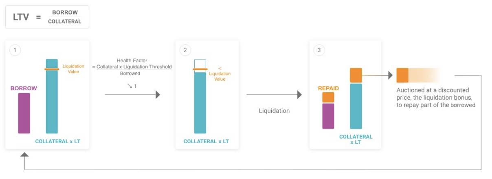

# AAVE V3 Important Parameters

## Borrow Interest Rate (APY)
### Interest Rate Strategy

Interest rate works with 2 slopes, a gentle one before the turning point generating low borrow interest to incentive borrows, and a steep one after it creating high interest rates to encourage repayments of debt and additional supply. [More information about this here](https://docs.aave.com/risk/liquidity-risk/borrow-interest-rate)

The X axi represents the utilization rate, meaning the percentage of the supplied asset amount that has been borrowed.
And the Y axi represents the variable Borrow APR.
In this graph we see that the turning point is the optimal point setted at 90%.

Most stable coins have their Optimal Utilization Rate at 90% for example [USDC](https://app.aave.com/reserve-overview/?underlyingAsset=0xa0b86991c6218b36c1d19d4a2e9eb0ce3606eb48&marketName=proto_mainnet_v3), but [USDT](https://app.aave.com/reserve-overview/?underlyingAsset=0xdac17f958d2ee523a2206206994597c13d831ec7&marketName=proto_mainnet_v3) has it at 80%. 

Aave’s borrowing costs must be aligned with market yield opportunities, or there would be a rate arbitrage with users incentivized to borrow all the liquidity on Aave to take advantage of higher yield opportunities.
With the rise of liquidity mining, Aave adapted its cost of borrowing by lowering the Uoptimal of the assets affected. This increased the borrow costs that are now partially offset by the liquidity reward. [More about this here](https://docs.aave.com/risk/liquidity-risk/borrow-interest-rate#model-parameters)

Most non-stable assets have their Optimal Utilization Rate at 45%, for example [ChainLink](https://app.aave.com/reserve-overview/?underlyingAsset=0x514910771af9ca656af840dff83e8264ecf986ca&marketName=proto_mainnet_v3), but there are exceptions like [Ethereum](https://app.aave.com/reserve-overview/?underlyingAsset=0xc02aaa39b223fe8d0a0e5c4f27ead9083c756cc2&marketName=proto_mainnet_v3) that has a Optimal Utilization Rate of 90%. 

It's crucial to distinguish assets that are used predominantly as collateral (i.e., volatile assets), which need liquidity at all times to enable liquidations. Second, the asset’s liquidity on Aave is an important factor as the more liquidity, the more stable the utilization. The interest rates of assets with lower liquidity levels should be more conservative.

#### Calculate Interest

Liquidity risk materializes when utilization is high, and this becomes more problematic as
U gets closer to 100%. To tailor the model to this constraint, the interest rate curve is split in two parts around an optimal utilization rate Uoptimal. Before Uoptimal the slope is small, after it begins rising sharply.
The interest rate Rt​ follows the model:

In the borrow rate technical implementation, the [calculateCompoundedInterest](https://github.com/aave/aave-v3-core/blob/e46341caf815edc268893f4f9398035f242375d9/contracts/protocol/libraries/math/MathUtils.sol#L51) method relies on an approximation that mostly affects high interest rates. The resulting actual borrow rate is as follows:

When U ≤ Uoptimal the borrow interest rates increase slowly with utilization
When U > Uoptimal the borrow interest rates increase sharply with utilization above 50% APY if the liquidity is fully utilized.

Both the variable and stable interest models are derived from the formula above from the [Whitepaper](https://github.com/aave/aave-protocol/blob/master/docs/Aave_Protocol_Whitepaper_v1_0.pdf) with different parameters for each asset.

Variable debt sees their rate constantly evolving with utilization.
Alternatively, stable debts maintain their interest rate at issuance until the specific rebalancing conditions are met.

#### Model Parameters

The parameters are in the [DefaultReserveInterestRateStrategy](https://github.com/aave/aave-v3-core/blob/27a6d5c83560694210849d4abf09a09dec8da388/contracts/protocol/pool/DefaultReserveInterestRateStrategy.sol#L10) smart contract.
If already deployed they can be changed using the [review-rate-strategies](https://github.com/wakeuplabs/vectium-deploy/blob/3223621530e19b3112dd3ff15d648167829c5817/tasks/misc/review-rate-strategies.ts#L17) task.
When deploying the [InterestRateStrategy](https://github.com/wakeuplabs/vectium-deploy/blob/3223621530e19b3112dd3ff15d648167829c5817/deploy/02_market/09_init_reserves.ts#L68) is obtained from [PoolConfig](https://github.com/wakeuplabs/vectium-deploy/blob/main/helpers/market-config-helpers.ts#L97) that has a configuration per network, for example [Polygon](https://github.com/wakeuplabs/vectium-deploy/blob/3223621530e19b3112dd3ff15d648167829c5817/markets/polygon/index.ts#L28). That takes the strategy of the token from [aave/reserveConfigs](https://github.com/wakeuplabs/vectium-deploy/blob/3223621530e19b3112dd3ff15d648167829c5817/markets/aave/reservesConfigs.ts) that sets the [RateStrategy](https://github.com/wakeuplabs/vectium-deploy/blob/3223621530e19b3112dd3ff15d648167829c5817/markets/aave/rateStrategies.ts) 

#### Rate Strategy Volatile One

Volatile assets need liquidity at all times and are thus calibrated at a low Optimal Utilization Ratio.
AAVE, BAL, CRV, DPI, GHST, LINK, SUSHI, WAVAX, WBTC, WETH, WFTM, WMATIC, WONE

| Parameter                           | Value     |
|-------------------------------------|-----------|
| Optimal Usage                       | 45%       |
| Base Variable Borrow Rate           | 0         |
| Variable Rate Slope 1              | 4%        |
| Variable Rate Slope 2              | 300%      |
| Base Stable Borrow Rate             | 2%        |
| Stable Rate Slope 1                | 7%        |
| Stable Rate Slope 2                | 300%      |
| Optimal Stable to Total Debt Ratio  | 20%       |

## Rate Strategy Stable One

Low liquidity stablecoins have a lower Optimal Utilization Ratio than those with higher liquidity (e.g., DAI, USDC).

| Parameter                           | Value     |
|-------------------------------------|-----------|
| Optimal Usage                       | 90%       |
| Base Variable Borrow Rate           | 0         |
| Variable Rate Slope 1              | 4%        |
| Variable Rate Slope 2              | 60%       |
| Base Stable Borrow Rate             | 2%        |
| Stable Rate Slope 1                | 0.5%      |
| Stable Rate Slope 2                | 60%       |
| Optimal Stable to Total Debt Ratio  | 20%       |

---

## Rate Strategy Stable Two

High liquidity stablecoins are calibrated to lower rates to encourage borrowing (e.g., SUSD, USDT, EURS, JEUR, AGEUR).

| Parameter                           | Value     |
|-------------------------------------|-----------|
| Optimal Usage                       | 80%       |
| Base Variable Borrow Rate           | 0         |
| Variable Rate Slope 1              | 4%        |
| Variable Rate Slope 2              | 75%       |
| Base Stable Borrow Rate             | 1%        |
| Stable Rate Slope 1                | 0.5%      |
| Stable Rate Slope 2                | 75%       |
| Optimal Stable to Total Debt Ratio  | 20%       |

---

When market conditions change, the interest rate parameters must be adjusted to adapt to utilization on Aave’s market as well as to incentives across DeFi.

### Stable Rate

Variable debt rates evolve constantly with utilization, while stable debts maintain their interest rate at issuance until specific rebalancing conditions are met. In V3, interest models are optimized by the new rate strategy parameter, **Optimal Stable/Total Debt Ratio**, to algorithmically manage stable rates.

#### Stable Interest Rate Rebalance

In certain conditions, the protocol enables stable rates to be rebalanced to avoid a large percentage of liquidity being borrowed at a stable rate below market variable rate. In V3, The condition for rebalance is if the current supply rate <= (supply of only  variable borrows * 0.9), [smart contract reference](https://github.com/aave/aave-v3-core/blob/27a6d5c83560694210849d4abf09a09dec8da388/contracts/protocol/libraries/logic/ValidationLogic.sol#L431).

## Supply Interest Rate (APY)

The borrow interest rates paid are distributed as yield for aToken holders who have supplied to the protocol, excluding a share of yields sent to the ecosystem reserve defined by the reserve factor. This interest rate is generated on the asset that is borrowed out and shared among all liquidity providers.

The supply APY \( D_t \) is calculated using the following variables:

- \( U_t \): Utilization ratio
- \( SB_t \): Share of stable borrows
- \( S_t \): Average stable rate
- \( VB_t \): Share of variable borrows
- \( V_t \): Variable rate
- \( R_t \): Reserve factor

You can view the protocol's deposit APY on the [Aave App](https://app.aave.com/reserve-overview/?underlyingAsset=0xd586e7f844cea2f87f50152665bcbc2c279d8d70&marketName=proto_avalanche_v3) for each asset. The average supply APY over a period also includes flash loan fees.

### Reserve Factor

Reserve factor is a percentage of interest which goes to a collector contract that is controlled by Aave governance to promote ecosystem growth.

## Risk Parameters

The risk parameters mitigate the market risks of the assets supported by the Aave protocol. Each borrow is based on over-collateralization with a different asset that may be subject to volatility. Sufficient margin and incentives are needed for the position to remain collateralized in the event of adverse market conditions. If the value of the collateral falls below a predetermined threshold, a portion of it will be auctioned as a **LIQUIDATION_BONUS** to repay part of the debt position and maintain the ongoing collateralization.

These parameters are calibrated on a per-asset basis to account for specific risks. For more information, visit the [Aave Risk Parameters documentation](https://docs.aave.com/risk/asset-risk/risk-parameters).

---

### Supply Caps

Supply caps define the maximum amount of an asset that can be supplied to the protocol. They can be used to limit the protocol’s exposure to riskier assets and protect against infinite minting exploits. A supply cap is an optional parameter, and its value will depend on the on-chain liquidity of the asset and the total volume of collateral assets in the pool.

### Borrow Caps

Borrow caps define the maximum amount of an asset that can be borrowed. They can be used to prevent traditional and flash borrowing of an asset that may experience a price exploit, leading to protocol insolvency. A borrow cap is an optional parameter, and its value will depend on the on-chain liquidity of the asset and the total volume of borrowed assets in the pool.

### Isolation Mode

Isolation mode can limit the systemic risk of listing riskier assets. It restricts an asset to borrow only isolated stablecoins and allows only a single isolated asset as collateral at a time. More info on isolation mode can be found [here](https://docs.aave.com/faq/aave-v3-features#isolation-mode) and [here](https://docs.aave.com/developers/whats-new/isolation-mode).

When a user supplies an “isolated asset” as collateral, they can only use that asset as collateral; even if they supply other assets to the protocol, they can only earn yield on those assets and cannot use them as collateral.

For instance, Chad is supplying `$TOKEN2` as collateral. `$TOKEN2` is an isolated asset with a maximum debt ceiling of $10M and with USDT, DAI, and USDC as borrowable assets. After supplying `$TOKEN2`, Chad can borrow up to $10M of USDT, DAI, and USDC. 

Even if Chad supplies another asset—let's say ETH—the V3 smart contracts will not allow him to borrow against those assets, although he will still earn yield on the supplied ETH. 

If Chad wishes to use all assets as collateral and exit isolation mode, he only needs to engage in a transaction to disable `$TOKEN2` as collateral (subject to all usual restrictions in the smart contracts relating to collateral ratio, liquidations, etc.). `$TOKEN2` can also exit isolation mode when Aave Governance votes on a proposal to remove the debt ceiling related to that asset.

### Siloed Mode

In V3, new assets with potentially manipulatable oracles (e.g., illiquid Uni V3 pairs where the price can be affected drastically by a single trade) can be listed in Siloed Mode to limit the overall risk of insolvency of the protocol. A siloed asset on the Aave Protocol restricts the borrower to single borrows only (i.e., a user borrowing a siloed asset cannot borrow any other asset).

### eMode

Efficient Mode (”eMode”) allows assets which are correlated in price (e.g., DAI, USDC, and USDT) to be listed in the same eMode category which maximizes capital efficiency by allowing higher LTVs when both the borrowed and collateral asset belong to the same eMode category. Currently, only a single eMode category is defined in the Aave Protocol V3 markets - Stablecoins, category 1.

Only assets of the same category (for example stablecoins) can be borrowed in E-mode. [See more in FAQ.](https://docs.aave.com/faq/aave-v3-features#high-efficiency-mode-e-mode)

V3 allows RISK_ADMINS and POOL_ADMIN, selected by Aave Governance, to configure up to 255 eMode categories, with each EModeCategory having the following risk management parameters:
- LTV (loan to value)
- Liquidation Threshold
- Liquidation Bonus
- Custom price oracle (optional)

See [Risks of this mode here.](https://governance.aave.com/t/gauntlet-aave-v3-e-mode-methodology/12278)

If a user self-selects to use the Aave Protocol in eMode, when that user supplies assets of the same category as the user’s collateral, the borrowing power (LTV), and maintenance margin (liquidation threshold) are overridden by the eMode category configuration to allow for higher capital efficiency.

#### An Example

Protocol defines eMode category 1 (stablecoins) as follows: 
- 97% LTV 
- 98% Liquidation threshold 
- 2% Liquidation bonus 
- No custom price oracle

Karen chooses eMode Category 1 (stablecoins).  
Karen supplies DAI (which normally has 75% LTV).  
Karen can borrow other stablecoins in Category 1 (including DAI) with the borrowing power defined by the eMode category (97%). Karen’s capital is therefore 22% more efficient.  

**Note:** In this example, Karen can supply other non-Category 1 assets to use as collateral; however, only assets belonging to the same eMode category chosen by the user will have enhanced category-specific risk parameters.

### Loan to Value

The Loan to Value (”LTV”) ratio defines the maximum amount of assets that can be borrowed with a specific collateral. It is expressed as a percentage (e.g., at LTV=75%, for every 1 ETH worth of collateral, borrowers will be able to borrow 0.75 ETH worth of the corresponding currency). Once a borrow occurs, the LTV evolves with market conditions.

### Liquidation Threshold

The liquidation threshold is the percentage at which a position is defined as undercollateralized. For example, a Liquidation threshold of 80% means that if the value rises above 80% of the collateral, the position is undercollateralized and could be liquidated. The delta between the LTV and the Liquidation Threshold is a safety mechanism in place for borrowers.

### Liquidation Penalty

The liquidation penalty is a fee rendered on the price of assets of the collateral when liquidators purchase it as part of the liquidation of a loan that has passed the liquidation threshold.

### Liquidation Factor

The liquidation factor directs a share of the liquidation penalty to a collector contract from the ecosystem treasury.

### Health Factor

For each wallet, these risks parameters enable the calculation of the health factor:

- Hf​ < 1: the position may be liquidated to maintain solvency as described in the Risk Parameters Safeguard Solvency diagram below.

### Reserve Factor

The reserve factor allocates a share of the protocol’s interests to a collector contract from the ecosystem treasury. Aave’s solvency risk is covered by the Safety Module, with incentives originating from the ecosystem reserve. As such, the Reserve Factor is a risk premium calibrated based on the overall risk of the asset. Stablecoins are the least risky assets with a lower reserve factor, while volatile assets hold more risk and have a higher factor.

### Collaterals

USDT and sUSD have increased risk exposure due to the risk of a single point of failure in their governance. Their counterparty risk is too high, both in terms of centralization and trust. For this reason, they cannot warrant the solvency of the protocol. Accordingly, these assets are limited to be used as collateral in Isolation Mode. On the other hand, agEUR and jEUR are decentralized; however, these assets have little battle-testing and cannot be used as collateral.

Overall, stablecoins are used both for borrowing and as collateral, while volatile assets, which many users are long on, are mostly used as collateral. Hence, users of the protocol still benefit from the addition of these stablecoins, and their risks are mitigated by the fact they cannot be used as collateral.

### From Risks to Risk Parameters

Market risks have the most direct impact on the risk parameters:

#### Liquidity

Liquidity based on on-chain liquidity and trading volume is key for the liquidation process. These can be mitigated through the caps and liquidation parameters (i.e., the lower the liquidity, the higher the incentives).

#### Volatility

Price volatility can negatively affect the collateral which must cover liabilities and safeguards the solvency of the protocol. The risk of the collateral falling below the borrowed amounts can be mitigated through the level of coverage required through the LTV. It also affects the liquidation process as the margin for liquidators needs to allow for profit. The least volatile currencies are stablecoins, followed by ETH. They have the highest LTV at 75% and the highest liquidation threshold at 80%. The most volatile assets have the lowest LTV at 35% and 40%. The liquidation thresholds are set at 65% to protect our users from a sharp drop in price which could lead to undercollateralization followed by liquidation.

#### Market Capitalisation

Market capitalisation represents the size of the market, which is key when it comes to liquidating collateral. While the risk of assets with smaller market capitalisations is more contained, it is often more volatile as these assets are generally less mature. A higher market capitalization, among other factors, typically signals a more developed ecosystem (i.e., more liquidity on exchanges, which enables liquidations with less of an impact on price). The market capitalisation, along with liquidity, both on exchanges and on Aave, allow for the quantification of liquidation risks. The liquidation parameters are therefore adjusted to mitigate the risk of a high price impact liquidation for assets with smaller markets (i.e., the smaller the market cap, the higher the incentives).

#### Overall Risk

The overall risk rating is used to calibrate the Reserve Factor with factors ranging from 10% for the less risky assets to 35% for the riskiest.
