# Deploy Fork Aave

This document aims to summarize each task within Aave's smart contract architecture. Although some features are beyond the scope of the current version, it is beneficial to include them here for reference.

**Out of scope features:** 
- Flash loans.
- Staking.
- Paraswap.

## Overview

The objective of this documentation is to provide an in-depth look at each step of the deployment process. Some configuration scripts will be included for context and clarity, but there is a separate document dedicated to configuration details.

## Summary

These are the main steps to fork the Aave protocol into a new blockchain network:

1. Config the network in `hardhat.config.ts`

Update the hardhat.config.ts file to include the new network configuration.

```typescript
export default {
...
  networks: {
    [eBobNetwork.testnet]: getCommonNetworkConfig(eBobNetwork.testnet, 111),
  }
...
 etherscan: {
    apiKey: ETHERSCAN_KEY,
    customChains: [{
        network: eBobNetwork.testnet,
        chainId: 111,
        urls: {
          apiURL: "https://testnet-explorer.gobob.xyz/api",
          browserURL: "https://testnet-explorer.gobob.xyz/",
        },
      }]
 }
 ...
}
```
2. **Update Constants in helpers/constants.ts:**
    - WRAPPED_NATIVE_TOKEN_PER_NETWORK
    - ETHEREUM_SHORT_EXECUTOR
3. **Add Network Configuration in helpers/hardhat-config-helpers.ts:**

Ensure that the new network is configured correctly by adding the following parameters:

 - NETWORKS_RPC_URL
 - LIVE_NETWORKS: true
 - GAS_PRICE_PER_NET

4. **Add New Market Configuration in helpers/market-config-helpers.ts:** If a new market is required, it should be added here. The market configuration for bob has already been included.
5. **Enable L2 Deployment Flag for the Pool:** Set the flag to deploy the pool for Layer 2 (L2) networks. This configuration is located in `markets/aave/commons.ts`.
6. **Configure the New Market:** Main configurations for the new market are found in the `markets/bob` folder. Key files include:
- markets/bob/index.ts: Contains all data related to the market configuration.
- markets/bob/reservesConfig.ts: Contains information about each strategy used for each reserve asset.

For more detailed information about the parameters of the assets, please refer to the following link:
 
[Parameter Details](https://docs.google.com/document/d/1w_a_6A4UtKjLdFpoOXSWTQpDMhVr8o1XRKS4RsFOda0): More details about each feature with examples.

**Custom oracle:** Our fallback oracle is automatically deployed. This allows for prices updates of each asset without needing chainlink.
**ChainlinkBypass:** UiPoolDataProviderV3 uses a chainlink aggregator, to overcome this we provide an empty bypass contract.

## Core components diagram
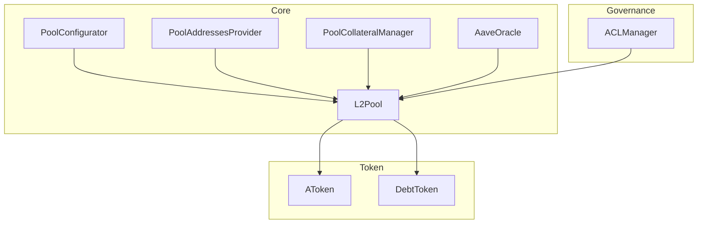
## Main sequence diagram
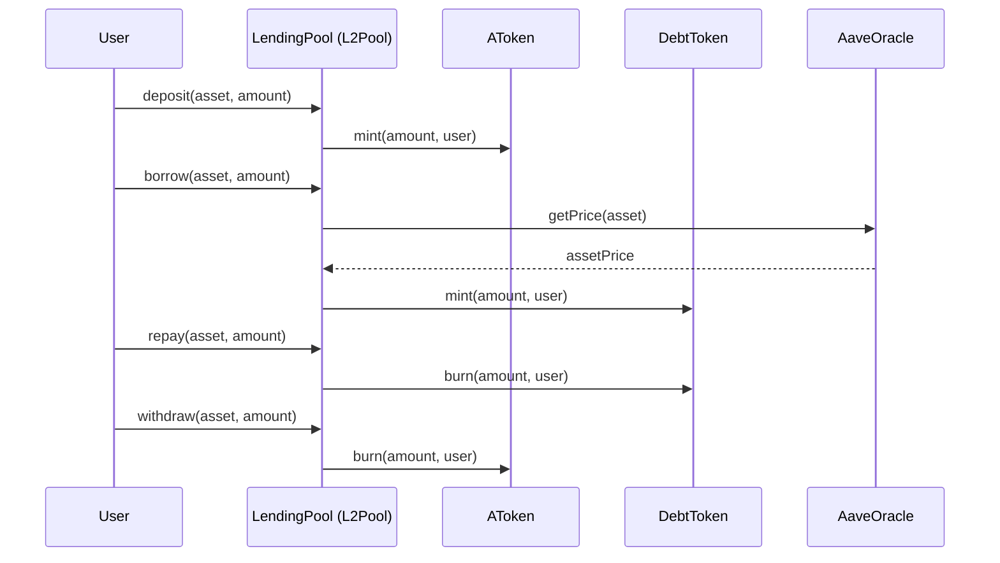

## Deploy Scripts

The deployment scripts offer the advantage of deploying multiple contracts and managing their interactions efficiently. With a dynamic and extensive configuration, they enable the deployment of the core protocol in a single step. For example, a list of assets can be configured, and the corresponding aTokens, StableDebtTokens, and other necessary components are automatically deployed based on the provided configuration.

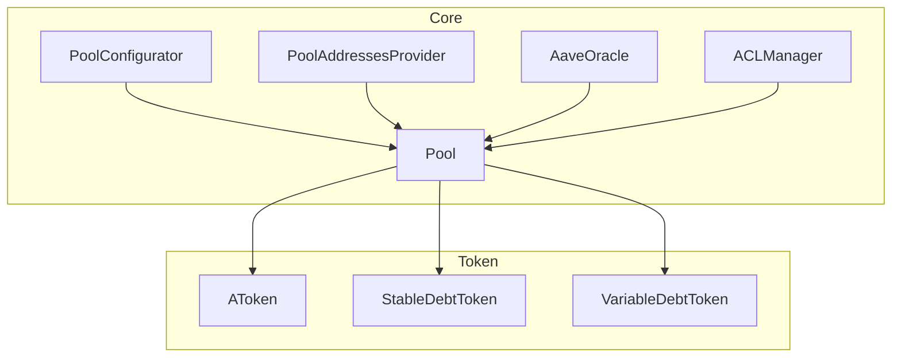

### Core

#### 00_markets_registry

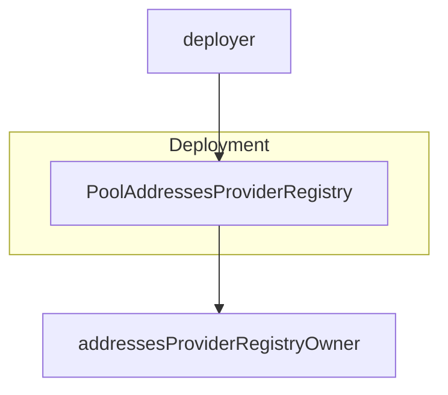


1. deploys a contract called `PoolAddressesProviderRegistry`.

- **PoolAddressesProviderRegistry:** It is used to register and manage the `PoolAddressesProviders`. This `PoolAddressesProviderRegistry` contract is responsible for keeping a record of all `PoolAddressesProviders` associated with different markets in the Aave protocol. 
- **`PoolAddressesProvider`:** The contract allows the registration of new addressesProviders, their removal, and retrieval of information about them. The ownership of the contract is managed through inheritance from `Ownable`, ensuring that only the owner can perform critical actions such as registering or removing addressesProviders. Each PoolAddressesProvider is uniquely identified by an ID. 

This contract is essential for maintaining the integrity and organization of the Aave ecosystem, ensuring that all key components are correctly registered and accessible.

#### 01_logic_libraries

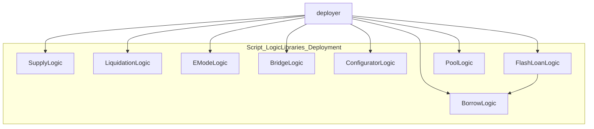


This deployment script is designed to deploy various key logic libraries that are essential for the operation of the Aave V3 protocol. These libraries handle different aspects of the protocol's logic, such as supply, liquidation, lending, etc.

- **SupplyLogic:** Handles the logic related to the supply of assets to the protocol.
- **BorrowLogic:** Contains the logic related to borrowing in the protocol.
- **LiquidationLogic:** Manages the liquidation logic in the protocol.
- **EModeLogic:** Used to handle the efficiency mode in the protocol.
- **BridgeLogic:** Handles the logic related to bridges between different networks.
- **ConfiguratorLogic:** Allows the configuration of different parameters of the protocol.
- **FlashLoanLogic:** Manages the logic for flash loans in the protocol. `FlashLoanLogic` must be linked with `BorrowLogic`.
- **PoolLogic:** Manages the main liquidity pool logic in the protocol.

### Periphery Pre

#### 10_periphery_pre

This script orchestrates the deployment of the Aave Ecosystem Reserve Treasury, including deploying a proxy contract, a controller, and the treasury's implementation. It carefully handles the initialization and upgrade paths to ensure that the contracts are correctly linked and managed, providing a robust and flexible treasury setup for the Aave protocol. The script is designed to handle both mainnet and testnet environments, making it versatile for different deployment scenarios.


#### Config: 

1. config just in mainnet. testnet uses deployer address

```typescript
export const BobConfig: IAaveConfiguration = {
  ReserveFactorTreasuryAddress: {
    [eBobNetwork.main]: ZERO_ADDRESS, // 
  },
}
```

2. Config treasury Admin.
    In code: Add pool admin `(helpers/constants.ts)`
    If the script is being run on a testnet, the deployer account is set as the treasuryOwner.

#### Contracts

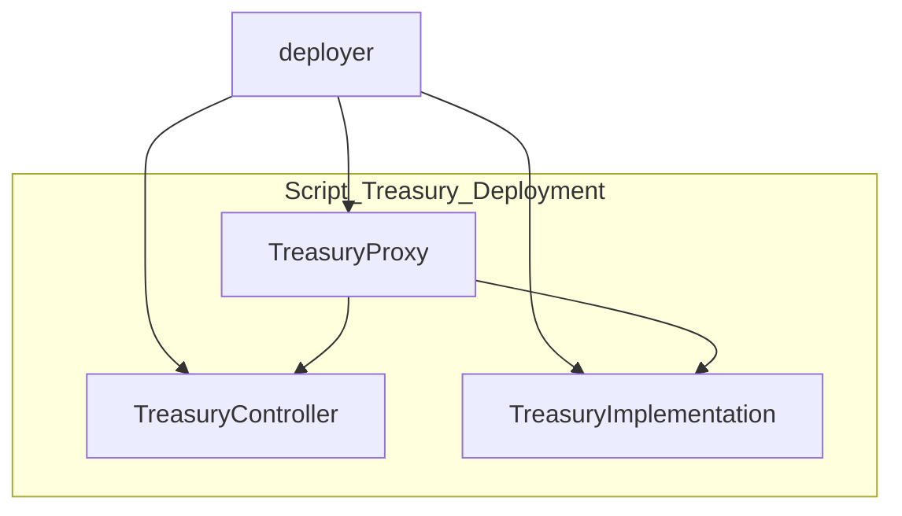


1. Deploy Treasury proxy
2. Deploy Treasury Controller
3. Deploy Treasury implementation and initialize proxy

- **InitializableAdminUpgradeabilityProxy:** Proxy contract that will be used to manage upgrades and point to the correct implementation of the treasury logic.
- **AaveEcosystemReserveController:** Deploys the controller contract that will manage the treasury. The treasuryOwner is set as the admin.
- **AaveEcosystemReserveV2:** Deploys the actual implementation of the treasury contract.

### Market

#### 00_token_setup

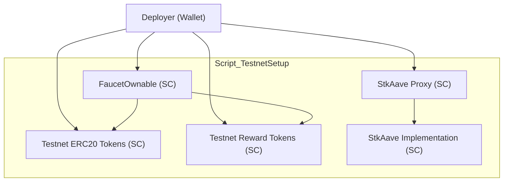

This script is focused on deploying and setting up testnet tokens, reward tokens, and the StkAAVE staking contract for a specific market within the Aave protocol. It's designed to handle configurations for different networks, particularly for testnets, where mock tokens and rewards need to be set up for testing purposes.

1. For testnet environments, the script deploys a FaucetOwnable contract.
2. The script loops through the reserves configuration to deploy mock tokens

```typescript
export const BobConfig: IAaveConfiguration = {
    ...
    ReservesConfig: {
        DAI: strategyDAI,
        USDC: strategyUSDC,
        WETH: strategyUSDC,
    },
    ...
}
```

- WETH9Mock: A mock of the Wrapped Native Token (like WETH) is deployed if required.
- TestnetERC20: Other ERC20 tokens are deployed for testing purposes.

3. Deployment of Reward Tokens (if incentives are enabled).
4. Deployment and Setup of StkAave.

#### 01_price_aggregators_setup

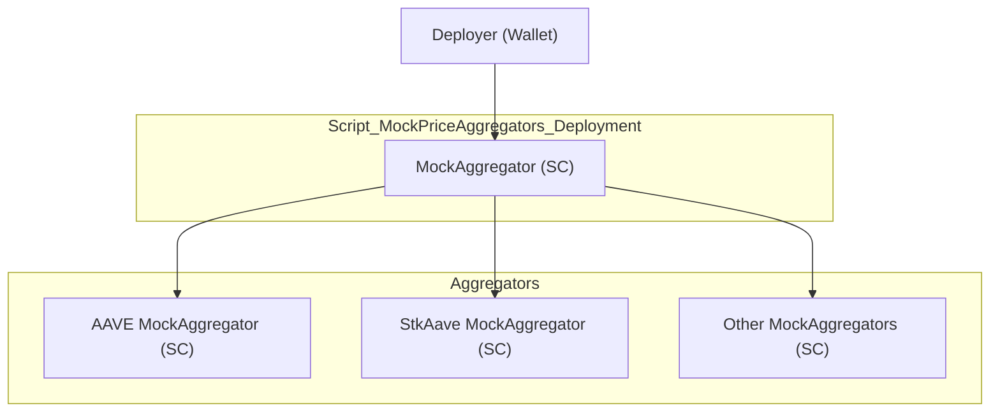

This script is focused on deploying mock price aggregators for a testnet environment, which are essential for simulating the price feeds that the Aave protocol relies on in a production environment. These mock aggregators will return fixed prices for various assets, allowing the protocol to function as if it were on a live network.


```typescript
export const BobConfig: IAaveConfiguration = {
    ...
    ReserveAssets: {
    [eBobNetwork.testnet]: {
      USDC: ZERO_ADDRESS,
      DAI: ZERO_ADDRESS,
      WETH: ZERO_ADDRESS,
    },
    },
    ...
}
```

The script iterates through each token symbol and deploys a mock price aggregator for it.
This part of the script is crucial as it ensures that each asset and reward token in the testnet environment has a corresponding price feed, enabling the protocol to operate as it would in a live setting.

##### Mainnet environment

This script and the previous one are specially for testing environments. For the live case, these steps are skiped and the configuration change a bit.
It is mandatory, define the address of the assets.

```typescript
export const BobConfig: IAaveConfiguration = {
    ...
    ReserveAssets: {
    [eBobNetwork.mainnet]: {
      USDC: "0x50...922",
      DAI: "0x4e...431",
      WETH: "0x93...C2E",
    },
    },
    ...
}
```


#### 00_setup_addresses_provider

```mermaid
graph TD
    subgraph Script_PoolAddressesProvider_Deployment
        PoolAddressesProvider["PoolAddressesProvider (SC)"]
        AaveProtocolDataProvider["AaveProtocolDataProvider (SC)"]
    end

    deployer["Deployer (Wallet)"] --> PoolAddressesProvider
		deployer["Deployer (Wallet)"] --> AaveProtocolDataProvider
  ```

This script is responsible for deploying and configuring the `PoolAddressesProvider` contract for a specific market in the Aave V3 protocol. 

- **PoolAddressesProvider**: The PoolAddressesProvider is a key component in the Aave architecture, as it acts as a central registry for managing various addresses related to the Aave protocol, including the AaveProtocolDataProvider.
- **AaveProtocolDataProvider**: Manage data retrieval across the protocol

1. Checks to ensure all reserves have non-zero addresses.
2. Deploy the PoolAddressesProvider
3. setMarketId
```typescript
  await addressesProviderInstance.setMarketId(poolConfig.MarketId)
```
4. addMarketToRegistry: Links the deployed PoolAddressesProvider to the Aave market registry.
5. deploy AaveProtocolDataProvider.

#### 01a_pool_implementation

This script is focused on deploying and initializing the common Pool contract for a specific Aave market. The Pool contract is a critical component of the Aave protocol, responsible for managing the liquidity pool where users can deposit and borrow assets. 

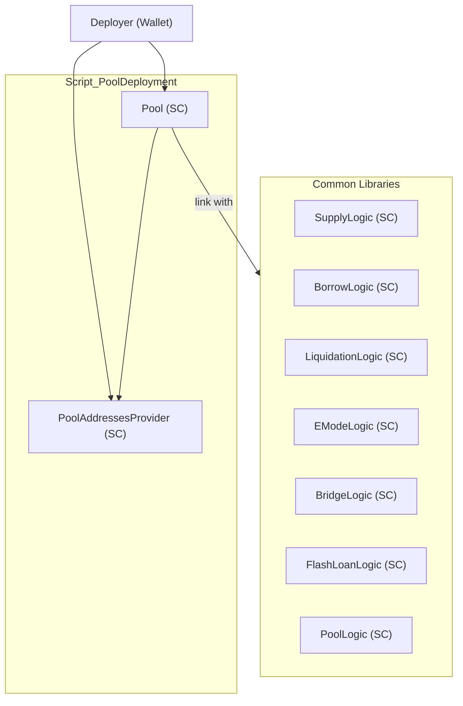

1. Checks whether the current network supports L2 pools (Layer 2 scaling solutions). If it does, the deployment is skipped
2. Deploy **Pool**
3. Initialize pool
4. Link with common libraries deployed at the first steps


This script automates the deployment and initialization of the Pool contract in the Aave protocol. It ensures that the Pool is properly linked to the PoolAddressesProvider and configured according to the specific market's settings. The script also checks if the current network supports L2 pools, skipping the deployment if necessary. This careful setup is crucial for ensuring that the Aave liquidity pool operates correctly across different environments.


#### 01b_l2_pool_implementation

This script is designed to deploy and initialize the L2Pool contract, which is specifically tailored for Layer 2 (L2) networks within the Aave protocol. The L2Pool contract handles liquidity pools on Layer 2 solutions, such as Optimism or Arbitrum, where different considerations apply compared to Layer 1 (L1) networks.

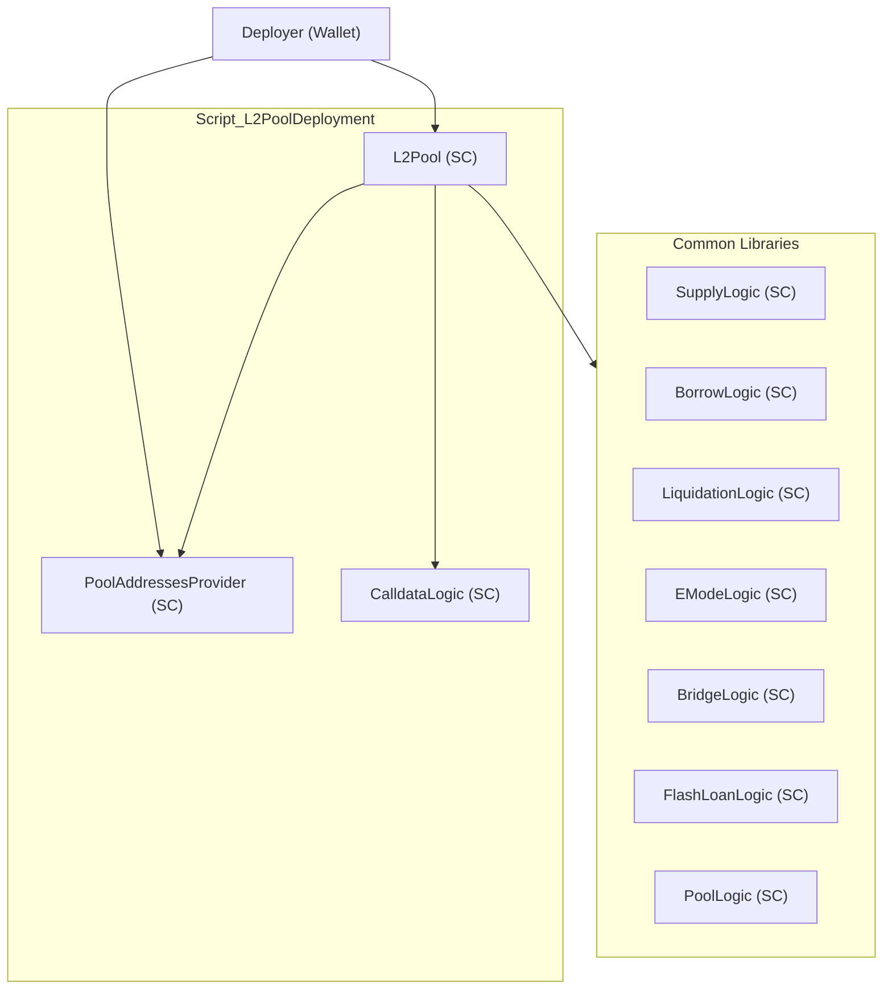

1. checks if the current network supports L2 pools
    a. if l2 disable finsihed
    b. continue 2

```typescript
export const BobConfig: IAaveConfiguration = {
   L2PoolEnabled: {
       [network]: true
   },
}
```

2. Deploy `CalldataLogic`.
3. Deploy `L2Pool`.

- **CalldataLogic:** Specific L2 Operations
- **L2Pool:** The contract is linked with the PoolAddressesProvider via addressesProviderAddress and the necessary libraries, including CalldataLogic, are attached.

This script automates the deployment and initialization of the L2Pool contract, specifically designed for Layer 2 networks within the Aave protocol. It checks if the current network supports L2 pools, deploys necessary libraries, and then deploys and initializes the L2Pool contract. This careful setup ensures that the Aave liquidity pool operates correctly in Layer 2 environments, which have different requirements and optimizations compared to Layer 1.

#### 02_pool_configurator

This script is focused on deploying and initializing the PoolConfigurator contract within the Aave protocol. 

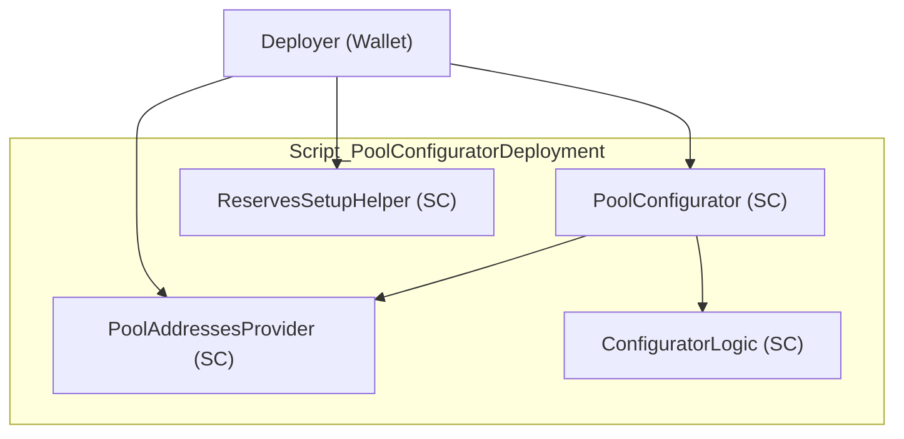

- **PoolConfigurator:** It is a crucial component that allows the protocol's administrators to configure and manage various parameters of the liquidity pools, such as interest rate strategies, reserve settings, and more.
- **ReservesSetupHelper:** A helper contract used to assist in setting up reserve assets.


1. Deploy PoolConfigurator
2. Deploy ReservesSetupHelper


This script automates the deployment and initialization of the PoolConfigurator contract, which is essential for managing the configuration of liquidity pools within the Aave protocol. The script carefully links the PoolConfigurator to the PoolAddressesProvider, initializes it, and also deploys the ReservesSetupHelper contract to assist in reserve setup. This setup ensures that administrators can efficiently manage and configure the parameters of the Aave protocol's liquidity pools.

#### 03_init_acl

This script is focused on deploying and configuring the ACLManager contract within the Aave protocol. The ACLManager is responsible for managing access control within the protocol, setting up roles such as the PoolAdmin, EmergencyAdmin, and others. This setup is crucial to ensure that the right administrators have the appropriate permissions to manage the protocol's operations.

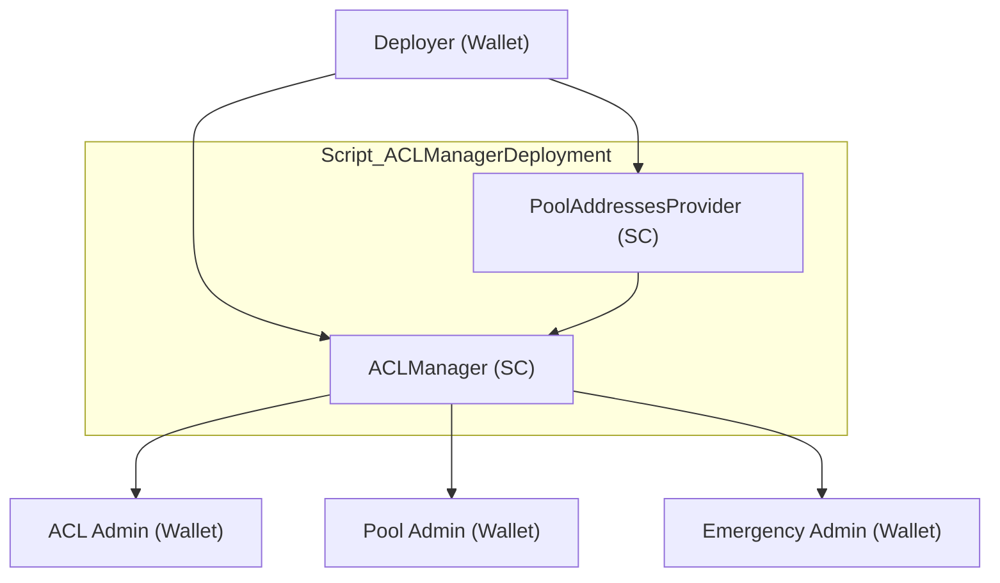

1. Sets the ACLAdmin in the PoolAddressesProvider, linking it to the aclAdmin account.
2. The script deploys the ACLManager contract and connects it to the PoolAddressesProvider.
3. Assigns PoolAdmin and EmergencyAdmin roles using the ACLManager

#### 04_deploy_oracles


#### Aave implementation

This script is designed to deploy the AaveOracle contract within the Aave protocol. The AaveOracle is crucial for obtaining price data for the assets within the protocol, using data from Chainlink oracles and potentially other sources. It plays a significant role in ensuring that the protocol operates with accurate and reliable price information.

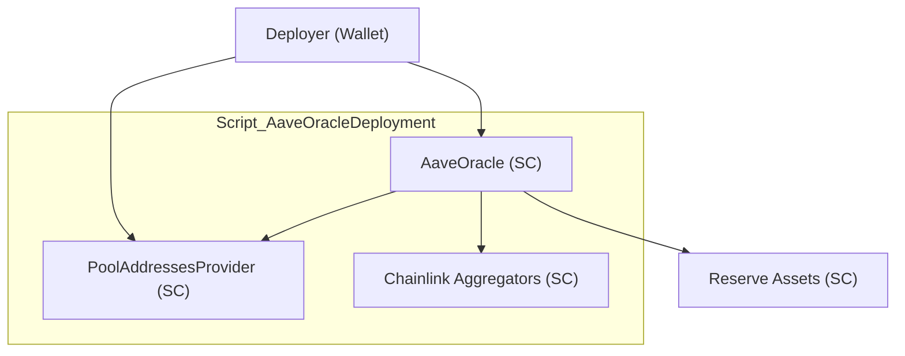


If it is set the network as live, it uses the config aggregators. Otherwise, it uses the mocks ones.

1. Deploy the `AaveOracle` contract using the retrieved information:
    - **addressesProviderAddress:** Links the AaveOracle to the PoolAddressesProvider.
    - **assets:** The list of assets the oracle will provide prices for.
    - **sources:** The corresponding Chainlink price aggregator addresses.
    - **fallbackOracleAddress:** A fallback oracle address, set to a zero address here.

#### Custom implementation

In this implementation, our fallback oracle for all assets is deployed as part of the aave-v3-deploy scripts. This setup allows flexibility in setting the initial prices for each asset through a configuration file, ensuring that the fallback oracle has the necessary price data from the start.

```typescript
// helpers/contrants.ts
export const MOCK_FALLBACK_ORACLE_PRICES: { [key: string]: string } = {
  USDC: parseUnits("1", 18).toString(),
  DAI: parseUnits("1", 18).toString(),
  WETH: parseUnits("2500", 18).toString(),
}
```

##### How to Update Fallback Prices

A script is provided to update the prices of each asset in the fallback oracle. Considering that high accuracy is crucial, the prices should be updated frequently to reflect market changes. Below is an example script that demonstrates how to update the fallback prices:

1. Define RPC_URL .env file or replace it by the url.
2. Define PRIVATE_KEY in .env file.
3. Instance the service and complete the addresses propertly.

```typescript
import {  BigNumber, ethers } from "ethers";

type Address = string;
export const provider = new ethers.providers.JsonRpcProvider(process.env.RPC_URL);

export class OracleService {
  private oracleAddress;
  private fallbackOracleAddress;
  private signer: ethers.Signer;
  constructor(oracleAddress: Address, fallbackOracleAddress: Address, signer: ethers.Signer) {
    this.oracleAddress = oracleAddress;
    this.fallbackOracleAddress = fallbackOracleAddress;
    this.signer = signer;
  }

  getAssetPrice = async (asset: Address) => {
    const oracleContract = new ethers.Contract(this.oracleAddress, [
      "function getAssetPrice(address asset) view returns (uint256)"
    ], provider);

    return await oracleContract.getAssetPrice(asset);
  }

  setAssetPrice = async (asset: Address, price: BigNumber) => {
    const oracleContract = new ethers.Contract(this.fallbackOracleAddress, [
      "function setAssetPrice(address asset, uint256 price)"
    ], provider).connect(this.signer);

    const tx = await oracleContract.setAssetPrice(asset, price.toBigInt());

    await tx.wait();
  }
}
```

Example of using the service:

```typescript
    const wallet = new Wallet(process.env.PRIVATE_KEY)
    const signer = wallet.connect(provider);
    const oracleAddress = "0xabc....def";
    const oracleFallbackAddress = "0xabc....def";
    const usdcAddress = "0xabc....def";

    const oracleService = new OracleService(oracleAddress, oracleFallbackAddress, signer);

    const newValue = parseEther("1.01");
    
    await oracleService.setAssetPrice(usdcAddress, BigNumber.from(newValue));
    const priceUSDC = await oracleService.getAssetPrice(usdcAddress);
```


#### 05_init_oracles

This script is focused on setting the price oracle in the Aave protocol's `PoolAddressesProvider` contract. The price oracle is a key component in DeFi protocols like Aave, providing accurate and reliable price data for the assets in the liquidity pool. The script ensures that the correct price oracle is associated with the PoolAddressesProvider.

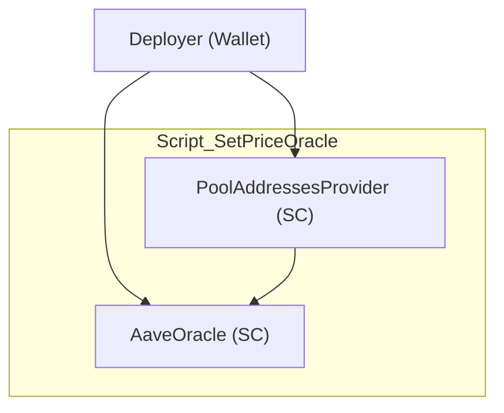

1. Set price oracle

This script ensures that the correct price oracle is associated with the PoolAddressesProvider in the Aave protocol. It checks if the oracle is already set, and if not, updates it to the new oracle address. This setup is crucial for the accurate functioning of the Aave protocol, as the price oracle provides essential price data for assets in the liquidity pool. The script is designed to be run once per market and network, ensuring consistency and reliability in the deployment process.

#### 06_init_pool

This script is designed to initialize the Pool and PoolConfigurator contracts within the Aave protocol. It handles the deployment and configuration of these critical components, which are essential for managing the liquidity pools and configuring various parameters, including flash loan premiums. The script also supports Layer 2 (L2) networks by deploying additional components when needed.

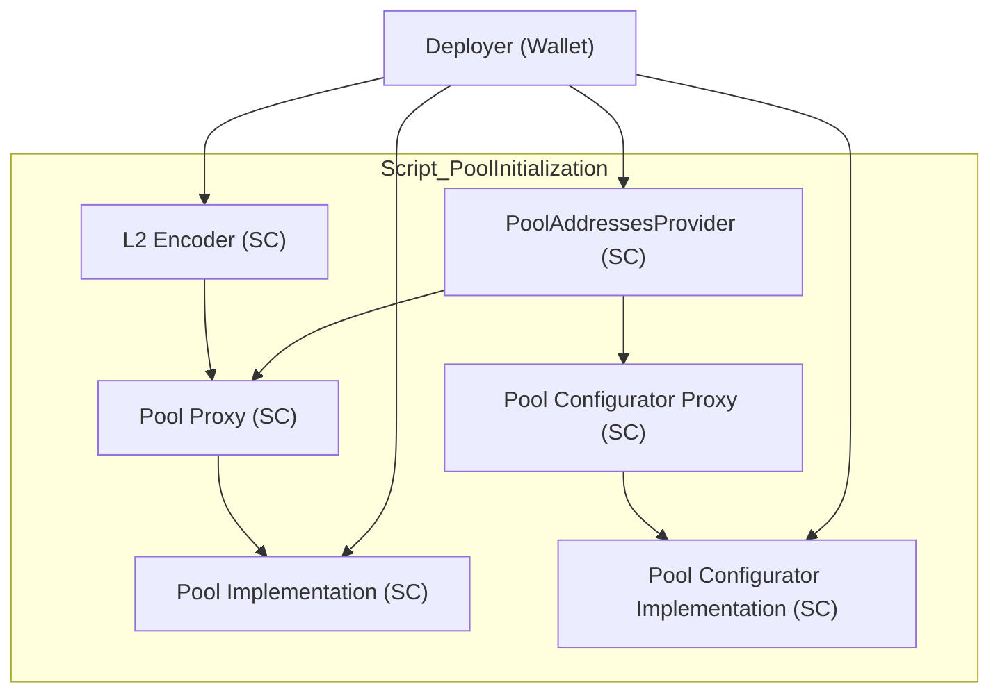

```typescript
export const BobConfig: IAaveConfiguration = {
    ...
    L2PoolEnabled: {
        [eBobNetwork.mainnet]: true
    }
    ...
```

1. Checks if the current network supports L2 pools and determines the correct Pool implementation to use.
2. Checks if the Pool proxy has been deployed. If not, the Pool implementation is set, and the proxy is deployed.
3. Similar to the Pool proxy, the script checks if the PoolConfigurator proxy is pending and sets it up if needed.
4. If the network supports L2 pools, the script deploys the L2Encoder.
5. configures the flash loan premiums in the PoolConfigurator.

This script is responsible for deploying and configuring the Pool and PoolConfigurator contracts, which are critical components of the Aave protocol. It handles the deployment of proxies for these contracts, initializes them, and sets up the necessary parameters, including flash loan premiums. The script also supports Layer 2 networks by deploying additional components such as the L2Encoder when applicable. This careful setup ensures that the Aave protocol operates smoothly across different environments.

#### 07_incentives

This script is focused on deploying and configuring the Incentives system within the Aave protocol. The Incentives system is crucial for rewarding users who interact with the protocol, such as by supplying liquidity or taking out loans. The script handles the deployment of various components like the EmissionManager, RewardsController, and different strategies for reward distribution.

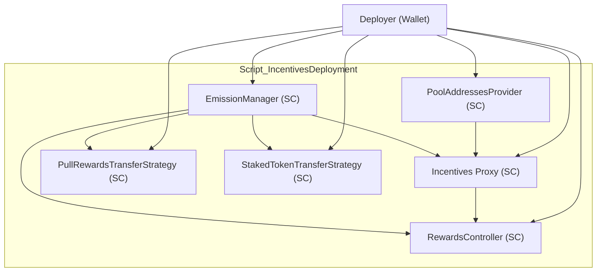

- **EmissionManager:** It is responsible for managing the distribution of rewards.
- **RewardsController:** Manages the logic for distributing rewards to users. The contract is initialized with a zero address to prevent others from calling it improperly.
- **PullRewardsTransferStrategy:** Manages the transfer of rewards using a pull-based approach.
- **StakedTokenTransferStrategy:** Manages the transfer of rewards involving staked tokens like StkAave.

1. Deploy EmissionManager
2. Deploy RewardsController
3. Sets up the proxy for the RewardsController in the PoolAddressesProvider
4. For non-live networks (e.g., testnets), the script deploys additional strategies like PullRewardsTransferStrategy and StakedTokenTransferStrategy.
5. transfers ownership of the EmissionManager to the incentivesEmissionManager.

This script is crucial for setting up the incentives system within the Aave protocol. It deploys and configures the EmissionManager and RewardsController, ensuring that the system is properly initialized and connected to the PoolAddressesProvider. The script also deploys additional reward distribution strategies for non-live networks and transfers ownership of the EmissionManager to the appropriate entity. This setup ensures that users interacting with the Aave protocol are rewarded appropriately for their participation.

#### 08_tokens_implementations

This script is focused on deploying and initializing several key token implementations within the Aave protocol. These tokens include AToken, DelegationAwareAToken, StableDebtToken, and VariableDebtToken, which are integral to the functioning of the Aave liquidity pools.

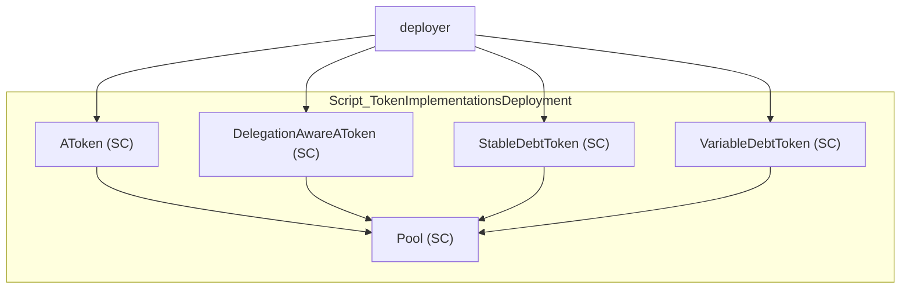

- **AToken:** Represents a user's stake in the Aave protocol's liquidity pools. Represents liquidity provided by users, earning interest and used as collateral.
- **DelegationAwareAToken:** Similar to AToken, but supports governance delegation.
- **StableDebtToken:** Represents debt with a stable interest rate, allowing users to borrow against their collateral.
- **VariableDebtToken:** Represents debt with a variable interest rate, allowing for more flexibility in borrowing.

1. Deploy AToken
2. Deploy DelegationAwareAToken
3. Deploy StableDebtToken
4. Deploy VariableDebtToken

This script automates the deployment and initialization of key token implementations within the Aave protocol, including AToken, DelegationAwareAToken, StableDebtToken, and VariableDebtToken. These tokens are crucial for managing user deposits, debts, and collateral within the Aave liquidity pools. The script carefully sets up each token, linking it to the correct pool and ensuring that it is properly initialized before being used in the protocol.

#### 09_init_reserves

This script is designed to initialize and configure the reserves (i.e., assets) in the Aave protocol. It involves deploying rate strategies, initializing reserves with ATokens and debt tokens, and configuring these reserves according to the protocol's requirements.

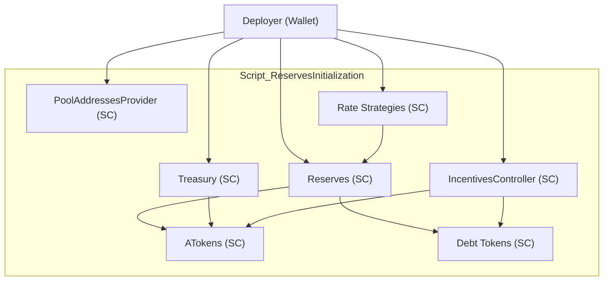

- **RateStrategies:** Configurations for how interest rates are managed for each reserve. The script iterates through these strategies, deploying a DefaultReserveInterestRateStrategy contract for each one. It is configurated on file `reserveConfigs`.

```typescript
export const strategyUSDC: IReserveParams = {
  strategy: rateStrategyStableOne,
  baseLTVAsCollateral: "0",
  liquidationThreshold: "0",
  liquidationBonus: "0",
  liquidationProtocolFee: "1000",
  borrowingEnabled: true,
  stableBorrowRateEnabled: false,
  flashLoanEnabled: false,
  reserveDecimals: "18",
  aTokenImpl: eContractid.AToken,
  reserveFactor: "1000",
  supplyCap: "2000000000",
  borrowCap: "0",
  debtCeiling: "0",
  borrowableIsolation: false,
}
```

1. Deploys rate strategies for each reserve. These strategies define how interest rates are calculated for borrowing and lending.
2. Initializes reserves by deploying the necessary ATokens and debt tokens (both stable and variable)
3. After initializing the reserves, the script configures them according to the specified parameters.  Configures the deployed reserves with parameters like interest rate strategies, liquidation thresholds, and other essential settings.

This script is critical for setting up the reserves (i.e., assets) within the Aave protocol. It handles the deployment of interest rate strategies, initializes reserves with ATokens and debt tokens, and configures these reserves according to the protocol's requirements. The script also saves the necessary deployment artifacts to ensure that the Aave protocol operates smoothly and is correctly configured across different networks and environments.

**NOTE:** Although there is an example about the strategy example above, there is an specific document about how to configurate them in details. Click here to get more details (link soon).

#### 10_init_periphery

**NOTE:** This script is not critical at all since flash loans are out of scope for this version.

This script is designed to deploy a mock flash loan receiver, which is useful for testing the Aave protocol on testnet environments. Flash loans are a feature of the Aave protocol that allow users to borrow assets without collateral, provided they are returned within the same transaction. The mock flash loan receiver is used to simulate and test this functionality in a controlled environment.

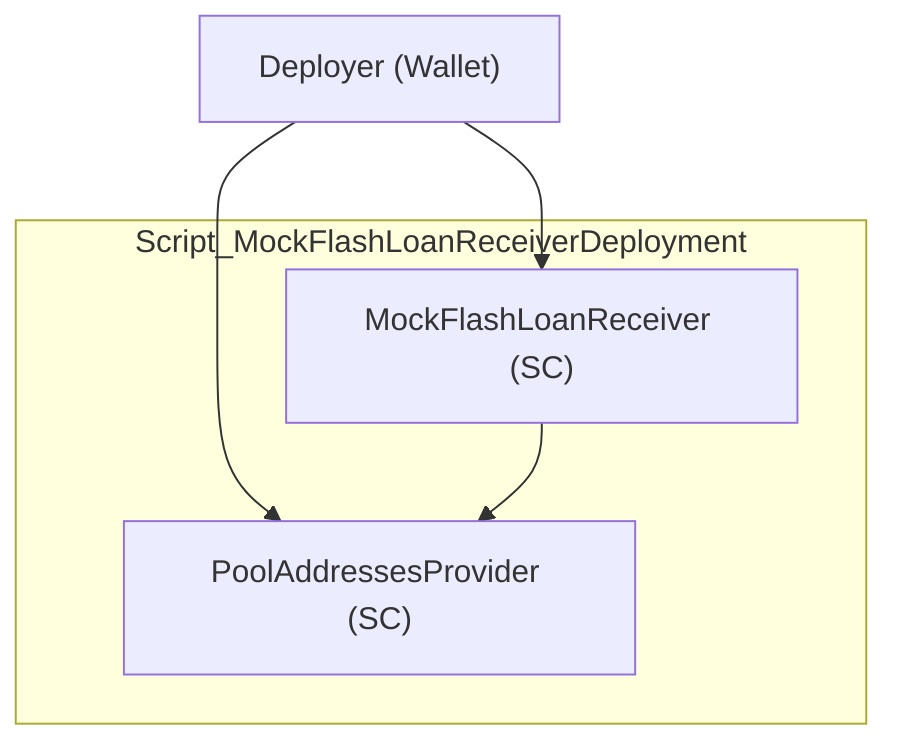

- **MockFlashLoanReceiver:** The contract is deployed only in non-live (testnet) environments, simulating the behavior of a flash loan receiver.

1. The script checks whether the network is a live environment or a testnet. If it is a testnet, it deploys the MockFlashLoanReceiver contract.

This script is designed to deploy a MockFlashLoanReceiver contract in testnet environments for the Aave protocol. The mock contract allows developers to simulate and test flash loan functionality in a controlled environment, which is crucial for ensuring the correctness and security of the protocol. The script carefully checks whether the current environment is a testnet before proceeding with the deployment, ensuring that this mock contract is not deployed on mainnet. This approach helps maintain the integrity of the production environment while providing the necessary tools for testing in non-production settings.

### Periphery post

#### 01_native_token_gateway

This script is designed to deploy the WrappedTokenGatewayV3 contract in the Aave protocol. The WrappedTokenGatewayV3 is responsible for handling wrapped native tokens like WETH (Wrapped Ether) in the protocol, allowing users to interact with the Aave liquidity pool using native tokens.

```mermaid
graph TD
    subgraph Script_WrappedTokenGatewayDeployment
        PoolProxy["Pool Proxy (SC)"]
        WrappedNativeToken["Wrapped Native Token (SC)"]
        WrappedTokenGatewayV3["WrappedTokenGatewayV3 (SC)"]
    end

    deployer["Deployer (Wallet)"] --> WrappedNativeToken
    deployer --> WrappedTokenGatewayV3
    WrappedTokenGatewayV3 --> WrappedNativeToken
    WrappedTokenGatewayV3 --> PoolProxy
```

1. Determines the address of the wrapped native token based on whether the deployment is for a testnet or a live network.
2. Deploy the `WrappedTokenGatewayV3` contract.

This script automates the deployment of the WrappedTokenGatewayV3 contract, which is a crucial component in handling wrapped native tokens (like WETH) within the Aave protocol. The script first determines whether the deployment is for a testnet or a live network and then identifies the appropriate wrapped native token address. Finally, it deploys the WrappedTokenGatewayV3 contract using this address along with the deployer's and pool proxy's addresses. This setup is essential for allowing users to interact with the Aave protocol using native tokens in a wrapped format.

#### 02_wallet_balance_provider

This script is designed to deploy the `WalletBalanceProvider` contract in the Aave protocol. 

```mermaid
graph TD
    deployer["Deployer (Wallet)"] --> WalletBalanceProvider["WalletBalanceProvider (SC)"]
```

- **WalletBalanceProvider:** is typically used to retrieve wallet balances for multiple tokens in a single call, which is useful for efficiently checking user balances across different assets.

#### 03-ui-helpers

This script is designed to deploy two utility contracts, UiIncentiveDataProviderV3 and UiPoolDataProviderV3, which are used to fetch and display data about the Aave protocol’s pools and incentives. These contracts provide an interface to query data, making it easier for front-end applications to retrieve and display relevant information.

```mermaid
graph TD
    deployer["Deployer (Wallet)"] --> UiIncentiveDataProviderV3["UiIncentiveDataProviderV3 (SC)"]
    deployer --> UiPoolDataProviderV3["UiPoolDataProviderV3 (SC)"]

    UiPoolDataProviderV3 --> ChainlinkAggregatorProxy["Chainlink Aggregator Proxy (SC)"]
    UiPoolDataProviderV3 --> ChainlinkEthUsdAggregatorProxy["Chainlink ETH/USD Aggregator Proxy (SC)"]
```

1. The script first checks if the chainlinkAggregatorProxy configuration exists for the current network. If it does not, it skips the deployment.
2. Deploys the UiIncentiveDataProviderV3
3. Deploys the UiPoolDataProviderV3

This script is focused on deploying two key utility contracts: UiIncentiveDataProviderV3 and UiPoolDataProviderV3. These contracts are crucial for front-end applications to retrieve and display data about the Aave protocol’s incentives and liquidity pools. The script first checks if the necessary Chainlink aggregator proxies are configured for the network and then proceeds with the deployment. This setup is essential for providing accurate and efficient data access in the Aave ecosystem.

##### Custom implementation

"Since this implementation is live without using Chainlink oracles, we need a custom Chainlink aggregator to utilize the UiPoolDataProviderV3."

### Before deploy

- Show balances

| (index) |               name               |                   account                    |        balance         |
|---------|----------------------------------|----------------------------------------------|------------------------|
|    0    |            'deployer'            | '0xb7...be5A' | '0.750744970370788489' |
|    1    |            'aclAdmin'            | '0xb7...be5A' | '0.750744970370788489' |
|    2    |         'emergencyAdmin'         | '0xb7...be5A' | '0.750744970370788489' |
|    3    |           'poolAdmin'            | '0xb7...be5A' | '0.750744970370788489' |
|    4    | 'addressesProviderRegistryOwner' | '0xb7...be5A' | '0.750744970370788489' |
|    5    |       'treasuryProxyAdmin'       | '0x6e25532943d0c02b832137EF1E6Ed2F78c51F30f' |         '0.0'          |
|    6    |      'incentivesProxyAdmin'      | '0x6e25532943d0c02b832137EF1E6Ed2F78c51F30f' |         '0.0'          |
|    7    |   'incentivesEmissionManager'    | '0xb7...be5A' | '0.750744970370788489' |
|    8    |     'incentivesRewardsVault'     | '0xb7...be5A' | '0.750744970370788489' |


### After deploy

This script is designed to execute a series of post-deployment tasks after the Aave protocol contracts have been deployed. These tasks include reviewing and setting up key protocol parameters, such as stable borrow rates, rate strategies, debt ceilings, isolation mode, e-modes, and liquidation fees. Additionally, the script handles testnet-specific tasks and can transfer ownership of the protocol if required.

#### Tasks

- **review-stable-borrow:** Ensures that stable borrow rates are enabled for selected assets.
- **review-rate-strategies:** Reviews and possibly adjusts the rate strategies for the assets.
- **setup-debt-ceiling:** Sets up debt ceilings for the assets, which limits how much can be borrowed.
- **setup-isolation-mode:** Configures assets that can be used in isolation mode, which is a risk management feature.
- **setup-e-modes:** Configures e-modes (efficiency modes) for different asset classes.
- **setup-liquidation-protocol-fee:** Sets up the protocol fee for liquidations.

#### Testnet-Specific Tasks

- **disable-faucet-native-testnets:** Disables the faucet's ability to mint and borrow the wrapped native token on testnets.
- **setPoolPause(false):** Unpauses the pool, allowing deposits and other operations.

#### Transfer ownership tasks

TRANSFER_OWNERSHIP: If this environment variable is set to true, the script will: 
- transfer protocol ownership.
- renounce the pool admin role.
- display the protocol roles.

This script is a comprehensive post-deployment hook that performs various essential tasks to finalize the Aave protocol deployment. It reviews and sets up key protocol parameters, handles testnet-specific configurations, and, if necessary, transfers ownership of the protocol. The script is designed to ensure that the deployed Aave protocol is correctly configured and ready for operation in both testnet and mainnet environments.

### Tansfer Ownership

```typescript 
export const POOL_ADMIN: Record<string, string> = {
  [eBobNetwork.mainnet]: "0xfea...a63e",
};
```

```typescript 
// .env
TRANSFER_OWNERSHIP=true
```

#### transfer protocol ownership.

This script is a Hardhat task designed to transfer ownership of the Aave protocol from the deployer to a specified admin account, which could be a multisig address or a governance bridge executor depending on the network. The script handles the ownership transfer of various critical components, including the Pool, ACLManager, PoolAddressesProvider, WrappedTokenGateway, and more.

1. The script checks if the ownership is already transferred to the desired admin. If not, it proceeds to transfer ownership of various components.
2. The script checks if the ownership is already transferred to the desired admin. If not, it proceeds to transfer ownership of various components.

- **ParaSwap Adapters:** Transfers ownership of ParaSwapLiquiditySwapAdapter, ParaSwapRepayAdapter, and ParaSwapWithdrawSwapAdapter.
- **Emergency Admin:** Transfers the emergency admin role to the desired admin.
- **Pool Admin:** Transfers the pool admin role to the desired admin.
**Pool Addresses Provider:** Transfers ownership of the PoolAddressesProvider.
**WrappedTokenGateway:** Transfers ownership of the WrappedTokenGateway.
**Emission Manager:** Transfers ownership of the EmissionManager.
**Default Admin Role:** Transfers the default admin role to the desired admin and revokes it from the deployer.

### renounce-pool-admin

This script is a Hardhat task that automates the process of renouncing the PoolAdmin role by the deployer in the Aave protocol. The script ensures that the deployer relinquishes this role only if the desired admin (typically a multisig wallet or governance executor) already has the PoolAdmin role.

The script checks whether the deployer currently holds the PoolAdmin role and whether the desired admin already has this role. Based on these checks, the script decides whether the deployer should renounce the role:

- **Scenario 1:** If the deployer is currently a PoolAdmin and the desired admin is also a PoolAdmin, the deployer renounces the role.
- **Scenario 2:** If the deployer has already renounced the PoolAdmin role, the script informs that the role was renounced in a previous operation.
- **Scenario 3:** If the desired admin is not a PoolAdmin, the deployer does not renounce the role, and the script warns that the multisig or guardian must be a PoolAdmin before the deployer can resign.

### Output

- Transferred the ownership of Emergency Admin
- Transferred the ownership of Pool Admin
- Transferred ACL Admin
- Transferred of Pool Addresses Provider and Market ownership
- Transferred of Pool Addresses Provider Registry
- Transferred WrappedTokenGateway ownership
- Transferred owner of EmissionManager from 0xb7...be5A to 0xfea...a63e
- Transferring the DEFAULT_ADMIN_ROLE to the multisig address
- Revoking deployer as DEFAULT_ADMIN_ROLE to the multisig address
- Revoked DEFAULT_ADMIN_ROLE to deployer 

| (index) |                   role                    |                   address                    | assert |
|---------|-------------------------------------------|------------------------------------------------|--------|
|    0    |                'PoolAdmin'                | '0xfea...a63e'   |  true  |
|    1    |       'PoolAddressesProvider owner'       | '0xfea...a63e'   |  true  |
|    2    |        'WrappedTokenGateway owner'        | '0xfea...a63e'   |  true  |
|    3    |          'EmissionManager owner'          | '0xfea...a63e'   |  true  |
|    4    | 'ACL Default Admin role revoked Deployer' |                  'REVOKED'                     |  true  |
|    5    | 'ACL Default Admin role granted Multisig' | '0xfea...a63e'   |  true  |