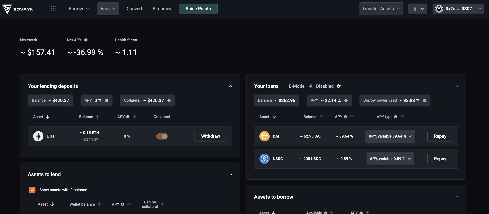
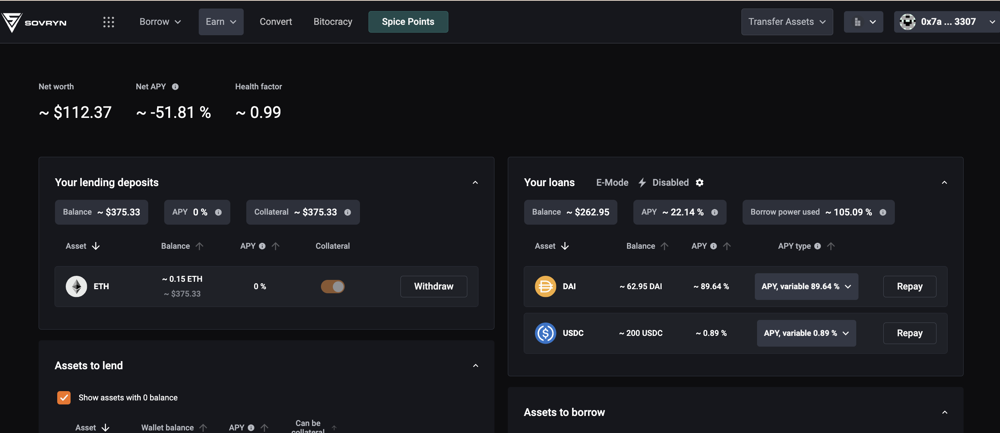
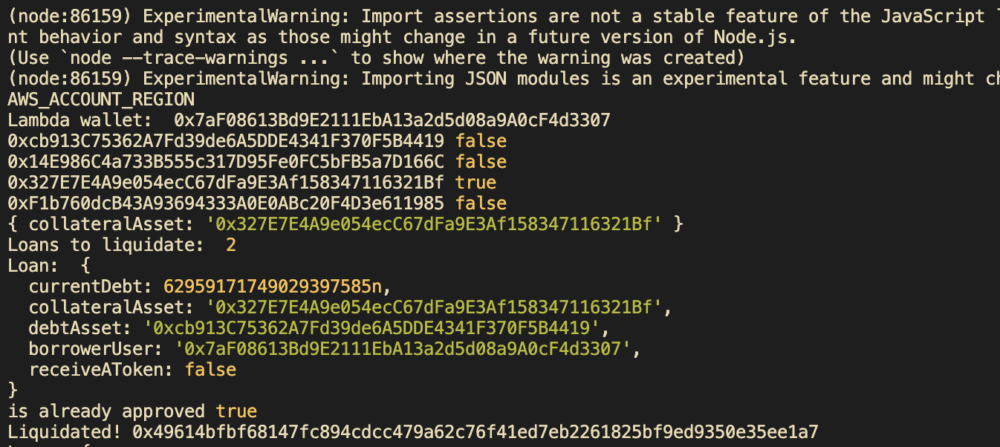
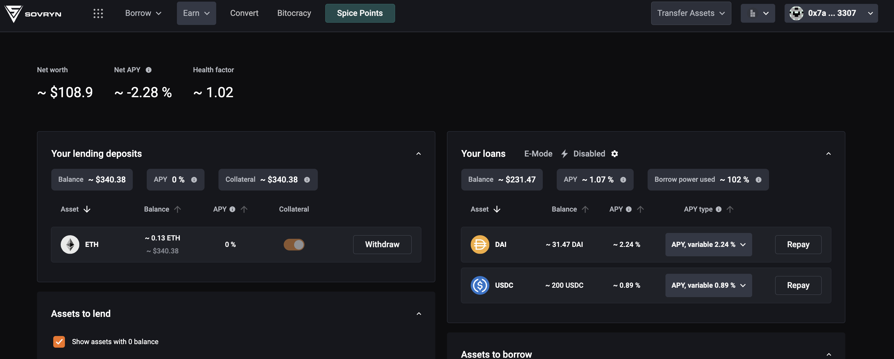

# Liquidation Process

Liquidations occur when a user's **Health Factor (HF)** drops below 1, signaling that their collateral no longer adequately covers their debt. In such cases, a portion of the collateral can be taken to repay the debt.

## Health Factor Calculation

The Health Factor is calculated using the user's total collateral, factoring in only reserves where collateral usage is enabled. This collateral value (in ETH) is multiplied by the liquidation threshold for each asset and divided by the user's total borrow balance (in ETH). For more details, refer to the [Aave documentation](https://docs.aave.com/developers/guides/liquidations#how-is-health-factor-calculated).


```typescript
  static computeHealthFactor(
    collateral: Decimal,
    currentLiquidationThreshold: Decimal,
    borrowedBalance: Decimal,
  ): Decimal {
    if (borrowedBalance.eq(0)) {
      return Decimal.from(Infinity);
    }
    return collateral.mul(currentLiquidationThreshold).div(borrowedBalance);
  }
```

## Liquidation Monitoring

The system monitors loans at regular intervals, checking their respective Health Factors. The most common cause of a Health Factor falling below 1 is a change in asset prices. To simulate a liquidation scenario, the asset prices can be modified accordingly.

## Liquidation Simulation

1. **User Takes a High-Risk Loan** (HF = 1.11)
   

2. The user cannot withdraw collateral until the Health Factor improves.

3. **Price Drop**: The ETH price (collateral) falls, reducing the Health Factor below 1.

4. The system detects that the conditions are met to execute liquidation.

5. **Liquidation Execution**:
   - The liquidator repays 50% of the user's debt in the debt asset (e.g., ETH).
   - The liquidator receives a portion of the collateral along with a liquidation fee.

Since the liquidator must repay the debt, they need sufficient balance in the debt asset to execute the liquidation.

### Example

| Token        | Address                                         | Current Price (8 decimals)   |
|--------------|-------------------------------------------------|------------------------------|
| USDC         | 0x14E986C4a733B555c317D95Fe0FC5bFB5a7D166C      | 100,000,000                  |
| DAI          | 0xcb913C75362A7Fd39de6A5DDE4341F370F5B4419      | 100,000,000                  |
| WETH         | 0x327E7E4A9e054ecC67dFa9E3Af158347116321Bf      | 280,000,000,000              |
| oracle WETH  | 0x5281b36049dDdcb2161dACab4ec5e80b638459c6      | N/A                          |
| oracle DAI   | 0xb062542b2A173fe90E885C1A2bF6C87F842167d0      | N/A                          |
| oracle USDC  | 0xb062542b2A173fe90E885C1A2bF6C87F842167d0      | N/A                          |

> **Note:** Oracles are mocks of the DIA interface (using the `latestAnswer` parameter). As they are mocks, they include a method to change the price, simulating price movements.

To execute a liquidation, adjust the ETH oracle price to, for example, 2500 USD, reducing the Health Factor below 1.  


### Liquidation Script

- The script detects when a loan becomes eligible for liquidation:

  

  [View Transaction](https://bob-sepolia.explorer.gobob.xyz/tx/0x40bb211b59a3b6f26c88487974d2fe8650a1606abbcf366a490def8852c94850)

In this transaction, 50% of the DAI debt is liquidated, and the liquidator takes the equivalent amount of collateral. As a result, the user's Health Factor improves, but if it remains insufficient, the script will continue monitoring and perform further liquidations if necessary.  



